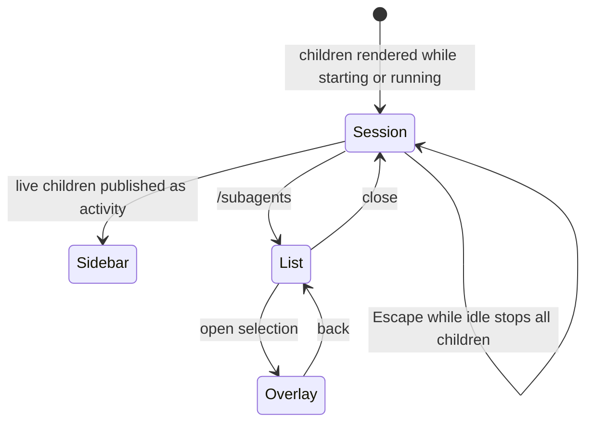

## 2. Problem Statement

Delegation the operator cannot see is delegation they cannot leave switched on — and with children
holding the same tools as the parent (`[C-10]` of the umbrella), watching them is the only bound there
is. The operator surface makes every running child visible ambiently in the status sidebar, lists and
opens them on demand, and stops all of them with one idle keypress (`[G-4]`, `[G-7]`).

Goals are owned by the umbrella.

## 3. Key Design Decisions

| Decision                    | Choice                                                                                                                                                              | Rationale                                                                                                                                                 |
| --------------------------- | ------------------------------------------------------------------------------------------------------------------------------------------------------------------- | --------------------------------------------------------------------------------------------------------------------------------------------------------- |
| `[KD-1]` Live indicator     | Starting and running children of the current session are rendered in the session; a child disappears on settling                                                    | The indicator answers "is something running now"; keeping settled agents there would turn the answer into a scan                                          |
| `[KD-2]` Ambient visibility | Live children are published to the shared activity state the status sidebar renders, alongside model, context, and git state                                        | It is the one view the operator already has open, so it is the only place a running child is noticed without being looked for (`[KD-13]` of the umbrella) |
| `[KD-3]` Full-chat overlay  | One agent at a time opens as a read-only overlay over its persisted session file, re-read as it grows                                                               | The child writes its own session file, so history survives restarts and needs no live channel, no replay protocol, and no attachment handshake            |
| `[KD-4]` One surface        | A single command lists this session's agents and opens one into the overlay                                                                                         | Listing and opening are one motion; a separate open-by-name command and a cross-session toggle are surfaces to maintain before anyone has missed them     |
| `[KD-5]` Panic key          | Escape while the session is idle stops every starting and running child, with no selection required; Escape during a turn is the host's own cancellation, untouched | Panic controls must need no aim, but the most-pressed key in the TUI keeps its existing meaning, and idle means no turn is waiting on a child's result    |
| `[KD-6]` Command set        | One command: `/subagents`                                                                                                                                           | There is one question the operator asks out loud — "what are my children doing" — and one place to answer it                                              |

## 4. Principles & Intents

- `[PI-1]` Look, never touch — refines umbrella `[PI-6]`: the only mutating operator action is stopping;
  everything else in this surface is read-only.

## 5. Non-Goals

- `[NG-1]` Typing into a child's conversation from the overlay — refines umbrella `[NG-7]`.
- `[NG-2]` Viewing or controlling another session's agents — refines umbrella `[NG-5]`.
- `[NG-3]` Stepping between agents from inside the overlay, or a screen for the feature's own
  configuration; both wait for demonstrated friction.

## 6. Caveats

- `[C-1]` The overlay renders what the child persisted, so a child that has produced nothing yet shows
  an empty conversation rather than an error, and updates lag the child by one write.
- `[C-2]` An agent pruned by retention while open stays readable until the overlay is closed.
- `[C-3]` Escape does not stop children while a turn is running, so stopping a child mid-turn means
  cancelling the turn first and pressing Escape again.

## 7. High-Level Components

N/A — the component inventory is owned by the umbrella.

## 8. Detailed Design

### API surface

A read-only overlay owns the child view: transcript rendering and scrolling over the agent's persisted
session file, re-read as the child appends to it.

Activity publication reuses the shared `RunningAgent` state (`src/shared/state/agent_activity.ts:5`):
one entry per starting or running child of the session, removed on settlement.

| Command      | Effect                                                                     |
| ------------ | -------------------------------------------------------------------------- |
| `/subagents` | Lists this session's agents and opens the selected one's full conversation |

A list row and each sidebar row are projections of the same record, not separately owned state. The
sidebar keeps its existing one-child-per-row rendering (`src/features/status_panel/sidebar.ts:162`):

```text
sidebar row: ▸ fix-parser                                   implementer
list row:    ● fix-parser   running   implementer   "Make parser errors preserve offsets…"
```

Selecting a `starting` agent opens an empty transcript, selecting a `running` or settled agent opens
the latest persisted transcript, and a record that disappears before selection yields the same
in-place error state as an unreadable session file.

### Interactions



The panic key is an observer of terminal input, active only while the session is idle and at least one
child is live; it calls the engine's interrupt-all for the current session and never touches the
host's turn cancellation. The children settle `interrupted` and deliver nothing, because idle means no
turn was waiting on them (`[KD-10]` of orchestration).

The key guard is evaluated before consuming the event:

| Parent turn | Live children | Escape result                                              |
| ----------- | ------------- | ---------------------------------------------------------- |
| Running     | Any           | Fall through to host cancellation                          |
| Idle        | One or more   | Consume the key and interrupt all current-session children |
| Idle        | None          | Fall through unchanged                                     |

The overlay refresh loop reads only complete persisted entries. A partial trailing write remains
invisible until the next successful read, which is the concrete meaning of the one-write lag in
`[C-1]`.

### Error handling

- Missing or unreadable session file → the overlay reports it and stays open.
- Activity state unavailable → children remain visible through the session indicator and the command,
  and the sidebar simply shows nothing.
- Escape pressed with no live children → nothing happens and the key falls through unchanged.

For a missing file, the overlay keeps its navigation and renders the error in place:

```text
fix-parser · completed
Conversation unavailable: session file could not be read.
[Back]
```

## 9. Open Questions

None.

## Changelog

| Date       | Amendment                                                                     | Sections affected | Reason                                                 |
| ---------- | ----------------------------------------------------------------------------- | ----------------- | ------------------------------------------------------ |
| 2026-08-21 | Add sidebar/list, selection, Escape guard, refresh, and missing-file examples | 8                 | Make operator states and host-key integration concrete |
