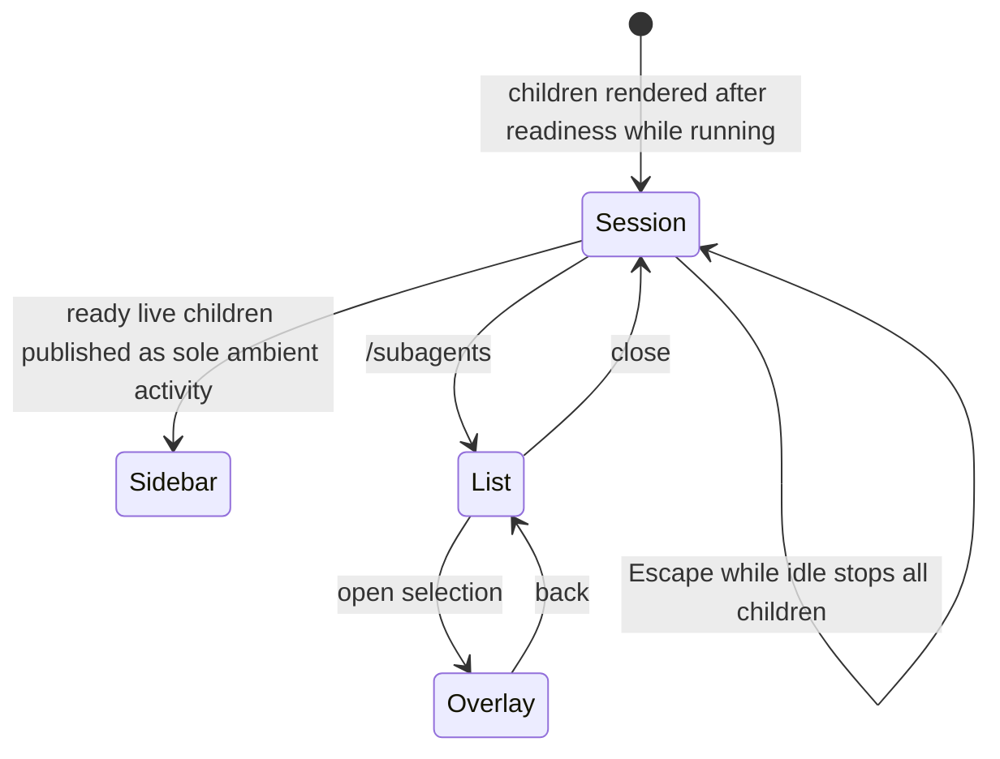

## 2. Problem Statement

Delegation the operator cannot see is delegation they cannot leave switched on. Tool and execution
limits provide automatic bounds, while the operator surface makes every ready running child visible
only in the status sidebar, lists and opens current-session records on demand, and stops all live
children with one idle keypress (`[G-4.1]`, `[G-5.2]`, `[G-7.1]`).

Goals are owned by the umbrella.

## 3. Key Design Decisions

| Decision                      | Choice                                                                                                                                                                                                                | Rationale                                                                                                                                                           |
| ----------------------------- | --------------------------------------------------------------------------------------------------------------------------------------------------------------------------------------------------------------------- | ------------------------------------------------------------------------------------------------------------------------------------------------------------------- |
| `[KD-1.1]` Live indicator     | Only ready running children of the current session are rendered; pre-ready work may have a private in-memory reservation but creates no public or durable record or sidebar entry, and a child disappears on settling | The indicator answers "is something running now" without exposing a spawn that never becomes a child                                                                |
| `[KD-2.1]` Ambient visibility | Ready live children are published only to the shared activity state the status sidebar renders, alongside model, context, git state, and per-agent activity time                                                      | It is the one view already open, so it is the sole ambient indicator (`[KD-13.1]` of the umbrella)                                                                  |
| `[KD-2.2]` Inactivity warning | When a ready live child first reaches five minutes without observed activity, the engine places one assistant warning on the session process's in-memory message queue                                                | The warning requests attention through ordinary message delivery, not a second persistent or ambient status surface; the sidebar remains the sole ambient indicator |
| `[KD-3.1]` Full-chat overlay  | One agent at a time opens as a read-only overlay over its persisted session file; it re-reads authoritative turn records and the transcript as they grow                                                              | Durable records support repeatable inspection without a live channel, notification replay protocol, or attachment handshake                                         |
| `[KD-4.1]` One surface        | `/subagents` lists this session's agents and opens one into the overlay; it is not ambient                                                                                                                            | Listing and opening are one motion; a separate open-by-name command and a cross-session toggle are surfaces to maintain before anyone has missed them               |
| `[KD-5.1]` Panic key          | Idle Escape stops every live current-session child, with no selection; it suppresses only interruption outcomes it causes and preserves pre-existing queued notices. Escape during a turn remains host cancellation   | Panic needs no aim without erasing unrelated results already queued for delivery                                                                                    |
| `[KD-6]` Command set          | One command: `/subagents`                                                                                                                                                                                             | There is one question the operator asks out loud — "what are my children doing" — and one place to answer it                                                        |

## 4. Principles & Intents

- `[PI-1]` Look, never touch — refines umbrella `[PI-6]`: the only mutating operator action is stopping;
  everything else in this surface is read-only.

## 5. Non-Goals

- `[NG-1]` Typing into a child's conversation from the overlay — refines umbrella `[NG-7]`.
- `[NG-2]` Viewing or controlling another session's agents — refines umbrella `[NG-5]`.
- `[NG-3]` Stepping between agents from inside the overlay, or a screen for the feature's own
  configuration; both wait for demonstrated friction.

## 6. Caveats

- `[C-1]` The overlay renders the exact owner-validated persistent session file the worker created or
  reopened for that agent, so a child that has produced nothing yet shows an empty conversation rather than
  an error, and updates lag the child by one write.
- `[C-2.1]` When an agent's age since `settledAt` reaches the retention limit, all its artifacts are
  deleted together; an overlay that already loaded its content stays readable until closed, while a later
  refresh shows the unavailable state.
- `[C-3.1]` Escape does not stop children while a turn is running, so stopping a child mid-turn means
  cancelling the turn first and pressing Escape again. API interrupt instead delivers its interruption
  result synchronously.
- `[C-4]` A PID mismatch is treated as stale ownership: the operator surface neither signals it nor
  retains it; the engine deletes all artifacts and releases the name.

## 7. High-Level Components

N/A — the component inventory is owned by the umbrella.

## 8. Detailed Design

### API surface

A read-only overlay owns the child view: transcript rendering and scrolling over the agent's persisted
session file and authoritative turn records, re-read as the child appends to them. `/subagents` remains
a current-session list and transcript overlay, not an ambient or cross-session view.

The shared activity contract (`src/shared/state/agent_activity.ts:5`) defines a ready live child with this
complete `RunningAgent` shape:

```ts
type RunningAgent = {
  agentId: string
  sessionId: string
  name: string
  profile?: string
  color: ThemeColor
  state: 'running'
  lastActivityAt: number // Unix milliseconds
}
```

The engine sets `lastActivityAt` at readiness and updates it when it observes child transcript or progress
activity. There is one activity entry per ready running child of the current session, and that entry is removed on settlement. Readiness is the point at
which a background child becomes visible; before then, any reservation is private in memory and there is
no public or durable record or activity entry.

| Command      | Effect                                                                     |
| ------------ | -------------------------------------------------------------------------- |
| `/subagents` | Lists this session's agents and opens the selected one's full conversation |

`/subagents` is a projection of the authoritative current-session record store. For a record with a
matching live `RunningAgent`, the list may enrich the row with live activity such as its running state or
last-activity time. It never uses activity entries as its source of truth: they disappear on settlement,
while records remain available for inspection. The sidebar renders the normal primary row for each ready
live activity entry; it is the sole persistent/ambient child indicator.

Task-name color only: `scout` blue, `librarian` purple, `reviewer` orange, `implementer` green, and
unknown profile gray/muted. Labels, status, and all other text use normal terminal color; `NO_COLOR`
disables these task-name colors.

Selecting a ready `running` or settled agent opens the latest persisted transcript and authoritative
turn record. A record that disappears before selection yields the same in-place error state as an
unreadable session file; no pre-ready agent can be selected.

### Verification contracts

- A pre-ready spawn that has only an in-memory reservation publishes no activity entry and creates no
  public or durable record; readiness publishes exactly one current-session entry, and settlement removes it.
- `/subagents` lists authoritative current-session records, including settled records after their matching
  activity entries have disappeared. With a matching live entry it enriches the record row; it neither lists
  an activity entry without a record nor treats activity state as the list's source of truth.
- With a controlled clock, a ready agent at 4m59s since `lastActivityAt` produces no inactivity warning.
  At 5m00s it enqueues exactly one assistant warning through the in-memory message queue. Delivery does not
  add or alter a sidebar row, and later clock ticks or activity do not enqueue a second warning for that turn.
- The sidebar and `/subagents` list include only current-session entries and records; an entry or record
  from another session is neither rendered nor selectable.
- If the shared activity state is unavailable, `/subagents` still lists current-session persisted records,
  while the sidebar renders no agent rows.
- Escape falls through to host cancellation while a parent turn is running and falls through unchanged while
  idle with no live children. While idle with live current-session children, it consumes the key, interrupts
  all of them, suppresses only interruption outcomes created by that invocation, and preserves notices that
  were already queued. The guard decorates each editor returned by the factory active at installation (or the
  default editor when none exists), delegates all fall-through input to that same editor, and restores the
  previous factory only if no later factory has replaced it.

### Interactions



The panic key decorates the editor instances created by the factory active at installation, so Pi's normal
focused-component dispatch determines when it receives input. It is active only while the session is idle
and at least one child is live; it calls the engine's interrupt-all for the current session and never touches
host turn cancellation. It suppresses only the interruption outcomes created by that invocation, preserving
notices queued before it. Teardown deactivates produced wrappers and restores the prior factory only while
this feature still owns the configured factory; it does not preserve arbitrary already-mounted editor
internals or compose a factory registered later. The engine API's targeted interrupt delivers its
interruption result synchronously; the key uses that API without replaying notifications (`[KD-10.1]` of the umbrella).

The key guard is evaluated before consuming the event:

| Parent turn | Live children | Escape result                                                                                                     |
| ----------- | ------------- | ----------------------------------------------------------------------------------------------------------------- |
| Running     | Any           | Fall through to host cancellation                                                                                 |
| Idle        | One or more   | Consume the key, synchronously interrupt all current-session children, and suppress only those resulting outcomes |
| Idle        | None          | Fall through unchanged                                                                                            |

The overlay refresh loop reads only complete persisted entries. A partial trailing write remains
invisible until the next successful read, which is the concrete meaning of the one-write lag in
`[C-1]`.

### Error handling

- Missing or unreadable session file → the overlay reports it and stays open.
- Activity state unavailable → `/subagents` remains the current-session list/transcript overlay; the
  sidebar shows no ambient child indicator.
- PID mismatch → do not signal the PID; delete all agent artifacts and release its name.
- Escape pressed with no live children → nothing happens and the key falls through unchanged.

For a missing file, the overlay keeps its navigation and renders the error in place:

```text
fix-parser · completed
Conversation unavailable: session file could not be read.
[Back]
```

## 9. Open Questions

N/A.

## Changelog

| Date       | Amendment                                                                                                                                                                                                                                                        | Sections affected | Reason                                                                                                   |
| ---------- | ---------------------------------------------------------------------------------------------------------------------------------------------------------------------------------------------------------------------------------------------------------------- | ----------------- | -------------------------------------------------------------------------------------------------------- |
| 2026-08-21 | Consolidate readiness-gated current-session visibility, the record-backed `/subagents` overlay and list, profile task-name colors, one-shot queue-delivered inactivity warnings, Escape delivery behavior, stale-PID cleanup, and focused verification contracts | 2, 3, 6, 8        | Keep activity ephemeral, records authoritative, and the sidebar as the sole persistent/ambient indicator |
| 2026-08-22 | Clarify that transcript inspection uses the worker's owner-validated exact persistent session file.                                                                                                                                                              | 6                 | Keep the overlay aligned with single-writer session ownership.                                           |
