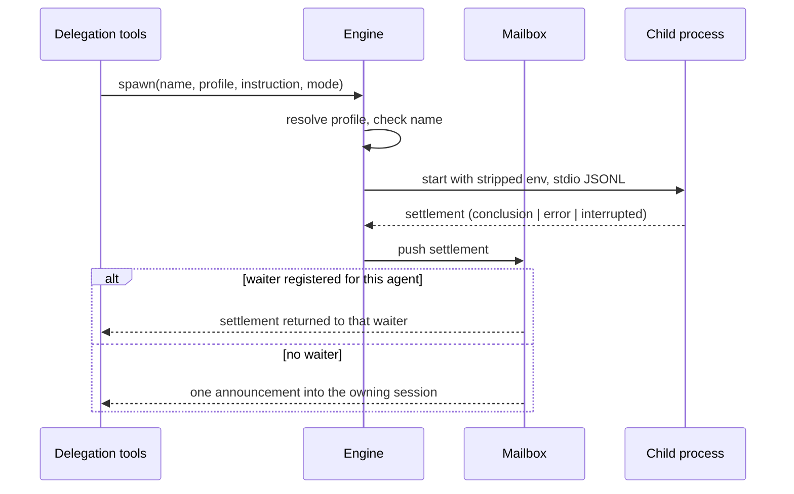

## 2. Problem Statement

One component owns the hard part of delegation: starting a child process, keeping its record durable,
resolving exactly one delivery route for its settlement, and guaranteeing that nothing is left running
or pending afterwards. It is where `[G-2]`, `[G-3]`, and `[G-6]` are either true or not.

Goals are owned by the umbrella.

## 3. Key Design Decisions

| Decision                        | Choice                                                                                                                                                                                       | Rationale                                                                                                                                                                |
| ------------------------------- | -------------------------------------------------------------------------------------------------------------------------------------------------------------------------------------------- | ------------------------------------------------------------------------------------------------------------------------------------------------------------------------ |
| `[KD-1]` Lifecycle states       | `starting`, `running`, `completed`, `failed`, `interrupted`, with the last three terminal                                                                                                    | Five states cover every question a caller or the operator asks, and separating `interrupted` from `failed` is what makes a deliberate stop legible in a listing          |
| `[KD-2]` Delivery arbitration   | A settlement is pushed to one mailbox, which claims a matching waiter if one exists and otherwise leaves one announcement pending; the mailbox de-duplicates so both routes never fire       | Delivery is at-most-once (`[G-2]`), and one arbitration point is what keeps a wait registered a microsecond either side of a settlement from producing two               |
| `[KD-3]` Late and early waits   | A wait on an already-settled agent returns its stored result immediately; a wait on a name unknown to this session fails immediately                                                         | Blocking on something that can never arrive is the failure mode that looks exactly like slow healthy work                                                                |
| `[KD-4]` Follow-up admission    | A follow-up is admitted when the agent belongs to this session, its profile still exists, no follow-up is already in flight for it, and its stored conversation is below the context ceiling | These are the four ways a follow-up can be meaningless, and checking them before delivery keeps the previous conclusion intact when one fails (`[PI-4]` of the umbrella) |
| `[KD-5]` Admission order        | Profile resolution, then name uniqueness, then process start — a refusal at either check leaves no record                                                                                    | A record for an agent that never ran shows up in listings and pollutes retention for no benefit; there is no concurrency check, because there is no ceiling              |
| `[KD-6]` Record store           | One JSON info file per agent beside its own session file and log, under a configurable runs directory                                                                                        | Per-agent files make a crash lose at most one record and let the operator read a child's conversation without the engine's cooperation                                   |
| `[KD-7]` Startup reaping        | Startup prunes aged and unparseable records, then terminates every ownership-verified orphan and settles its record `interrupted`                                                            | An orphan's stdio belongs to a dead parent, so it can never be heard from again; adopting it would show a child that is visible but permanently mute                     |
| `[KD-8]` Signalling safety      | A child is signalled only after ownership is verified against the recorded process identity                                                                                                  | A recycled PID makes a naive kill an arbitrary-process kill on the operator's own machine                                                                                |
| `[KD-9]` Child channel          | Length-bounded JSONL frames over the child's stdin and stdout; the transcript is read from the child's own session file on disk                                                              | One channel for control and none for history: the session file is already written, already restart-proof, and already what the overlay renders                           |
| `[KD-10]` Stop semantics        | Stopping the session's children settles each as `interrupted` and delivers nothing; the stop is only reachable while the session is idle (`[KD-10]` of the umbrella)                         | Idle means no turn is in flight, so there is no conversation waiting on a result that a stop would be destroying                                                         |
| `[KD-11]` Freeze at the ceiling | An agent whose conversation reaches its context ceiling stays settled and readable, with further follow-ups refused rather than the agent terminated                                         | The accumulated work is the valuable part; terminating to enforce a bound would destroy exactly what the bound was protecting                                            |

## 4. Principles & Intents

- `[PI-1]` One owner per settlement — refines umbrella `[PI-3]`: at any instant a settlement is owed to
  at most one destination, and the transition between destinations is atomic.

## 5. Non-Goals

- `[NG-1]` Cross-session operations of any kind — refines umbrella `[NG-5]`: every call, reading or
  mutating, filters on the owning session before doing anything.
- `[NG-2]` Resuming or adopting a child's conversation after a restart — refines umbrella `[NG-6]`; the
  conclusion is durable, the live process is not (`[C-9]` of the umbrella).
- `[NG-3]` Limiting how many children a session runs — refines umbrella `[C-11]`.

## 6. Caveats

- `[C-2]` Retention pruning is time-based and configurable, defaulting to seven days, and `0` switches
  it off entirely.
- `[C-4]` Nothing throttles spawning, so a runaway assistant can start children until the machine
  complains. The sidebar shows them and Escape stops them.

## 7. High-Level Components

N/A — the component inventory is owned by the umbrella.

## 8. Detailed Design

### Data model

The agent record carries identity (id, task name), session binding, the resolved
profile and model fields, paths to its own session file, info file, and log, the recorded process
identity, timestamps and counters, the in-flight follow-up marker, lifecycle status, and its result or
error. The on-disk projection is validated on read; an unparseable record is pruned rather than
crashing startup.

The persisted shape keeps platform-specific process verification behind an opaque identity token while
retaining the PID needed to signal a verified process:

```ts
type AgentStatus = 'starting' | 'running' | 'completed' | 'failed' | 'interrupted'

interface AgentRecord {
  id: string
  taskName: string
  ownerSessionId: string
  profile: { key: string; provider: string; model: string; contextCeiling: number }
  files: { info: string; session: string; log: string; fullResult?: string }
  process?: { pid: number; identity: string }
  status: AgentStatus
  createdAt: string
  settledAt?: string
  consumedTokens: number
  followUpInFlight: boolean
  result?: string
  error?: { code: string; message: string }
}
```

For agent id `01J...7M`, the sibling files are `01J...7M.json`, `01J...7M.session`, and
`01J...7M.log`; lookup of task `probe` still requires `ownerSessionId === currentSession.id`.

Derived views stay narrow: a list entry carries name, status, profile, and a last-task preview; a
response entry carries one agent's latest conclusion.

Task names are unique among a session's agents, so `probe` may exist once here and once in every other
session. The session is a filter on every lookup, not part of a key: records are keyed by their opaque
`id`, which is also the filename stem for the record, session file, and log, and an agent is found by
matching session and task name. No composite name is stored.

Records live under this package's own agent directory, in a configurable runs directory. There is no
legacy location and no migration.

### API surface

One engine object owns the whole lifecycle:

- spawn — resolve, admit, and start a child; a foreground spawn resolves on settlement, a background
  spawn resolves on acceptance and names the agent and its profile.
- wait — one named agent, the next of many to settle, or a set of agents until all have settled.
- read — the list view for this session, one agent's latest conclusion, and one agent's stored
  conversation read from its session file.
- continue — deliver one follow-up: steering the turn in progress when running, otherwise resuming the
  stored conversation for one further turn.
- interrupt — one agent, or every starting and running agent of a session.
- lifecycle — startup reaping and pruning, session-end shutdown of owned children, and publication of
  live children to the shared activity state (`[G-7]`).

Completion and inactivity events are what the delegation-tools layer subscribes to. An oversized
conclusion is stored in full beside the record, and delivery carries the truncated text plus the
location of the whole (`[C-7]` of the umbrella).

The child channel carries only control and lifecycle frames. Each JSON object occupies one line and is
encoded and byte-checked before writing; a malformed or over-limit line fails that agent rather than
being partially parsed.

```jsonl
{"type":"ready","agentId":"01J...7M"}
{"type":"follow_up","requestId":"f1","message":"Check the failure branch."}
{"type":"settled","requestId":"f1","status":"completed","conclusion":"The guard is correct."}
```

```ts
const bytes = Buffer.byteLength(JSON.stringify(frame), 'utf8') + 1
if (bytes > MAX_FRAME_BYTES) failAgent('frame_too_large')
```

### Interactions



Mailbox arbitration is atomic with respect to waiter registration and settlement:

```ts
function settle(result: Settlement) {
  persist(result)
  const waiter = mailbox.claimWaiter(result.agentId)
  if (waiter) waiter.resolve(result)
  else mailbox.enqueueAnnouncement(result) // one de-duplicated item per settlement
}
```

Thus settlement before `wait` leaves an item that the wait can claim, settlement after `wait` resolves
that waiter, and either case consumes the only delivery right. An abandoned waiter releases its claim
back to the pending-announcement path.

Follow-up routing: a follow-up steers a running turn or resumes a settled one. A second follow-up
arriving while one is in flight for the same agent is refused, not queued, so ordering is never
ambiguous.

```text
running + send_message("narrow the scan") -> steer current turn
completed + send_message("check tests")   -> one resumed turn
follow-up already in flight               -> refuse; do not queue
consumedTokens >= contextCeiling           -> refuse; preserve stored conclusion
```

### Error handling

- Child crashes, vanishes, or never becomes ready within the startup timeout → the agent settles
  `failed` with a diagnosable reason, delivered by whichever route it was owed.
- Two delegations race on one task name in one session → one agent is created, the other refused.
- Interrupting an already-settled agent → no change; the existing outcome is reported.
- A working child producing no visible activity past the inactivity threshold → one warning event, and
  the child keeps running, because a slow healthy task must not be killed.
- Retention pruning skips running agents (`[C-5]` of the umbrella); a record pruned while its
  conversation is open stays readable in the open view and disappears from listings.
- Orphan found at startup whose process identity does not match the record → the process is left alone
  and the record settles terminal, because the PID has been recycled.
- Process exit with the parent gone → the child is signalled during session-end shutdown, after
  ownership verification, so no child outlives its session in the normal case.

## 9. Open Questions

None.

## Changelog

| Date       | Amendment                                                                      | Sections affected | Reason                                                                  |
| ---------- | ------------------------------------------------------------------------------ | ----------------- | ----------------------------------------------------------------------- |
| 2026-08-21 | Add record, JSONL framing, mailbox arbitration, and follow-up routing examples | 8                 | Pin down the engine's non-trivial persistence and concurrency contracts |
