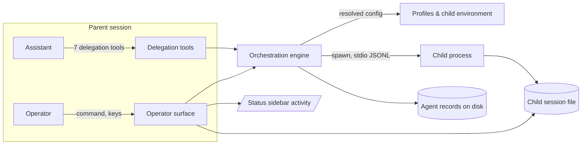

## 2. Problem Statement

A single assistant conversation loses effectiveness whenever it has to absorb a read-heavy errand:
scanning an unfamiliar tree, chasing a citation on the web, re-reading a diff for review, or grinding
out a mechanical edit across files. Each errand floods the working context with material that is
worthless once the answer is known, and one conversation cannot run two errands at once. Sub-agents
let the assistant hand a narrow task to a fresh-context child process and receive only the conclusion,
with the operator able to watch every child and stop all session children whenever the parent is idle.

- `[G-1]` An assistant delegates a narrow task to a fresh-context child and receives only its
  conclusion; the child's intermediate work never enters the assistant's conversation.
- `[G-2.1]` Each child turn has a durable, authoritative record; its automatic notification is
  best-effort, at most once, and is never replayed after the session process ends.
- `[G-3]` Independent errands run concurrently without the assistant duplicating a pending child's
  work.
- `[G-4.1]` The operator sees every ready running child in the sidebar, lists and reads any
  current-session child, and stops all live children with one keypress while the parent session is idle.
- `[G-5.2]` Every delegation follows its profile's tool policy and the session's fixed execution
  bounds; policy is not an OS sandbox.
- `[G-6.1]` Nothing stalls: targeted reads and waits are repeatable and bounded. An omitted-target wait
  snapshots eligible currently live/unclaimed turns and queued settlement notices, returns `empty_targets`
  immediately when none exist, and never waits for a future not-yet-created agent; a live turn reaches
  its execution deadline at 30 minutes and resolves after at most five seconds of termination grace.
  Records and private pre-ready launch leases survive long enough for restart cleanup to leave no owned worker process behind; child-created descendants receive best-effort process-group/tree cleanup only while the worker identity remains verifiable.
- `[G-7.1]` A ready running child is visible without the operator asking: the current session's status
  sidebar is the sole ambient indicator.
- `[G-8]` A delegated errand may change files and verify its own work, not only report on them.

## 3. Key Design Decisions

| Decision                                     | Choice                                                                                                                                                                                                                                                                                                                                                                                                                                                                                                                                                                                                | Rationale                                                                                                                                                                                                                                               |
| -------------------------------------------- | ----------------------------------------------------------------------------------------------------------------------------------------------------------------------------------------------------------------------------------------------------------------------------------------------------------------------------------------------------------------------------------------------------------------------------------------------------------------------------------------------------------------------------------------------------------------------------------------------------- | ------------------------------------------------------------------------------------------------------------------------------------------------------------------------------------------------------------------------------------------------------- |
| `[KD-1]` Ownership scope                     | An agent belongs to the session that created it; it is listed, read, steered, and stopped only from there, and there is no cross-session view                                                                                                                                                                                                                                                                                                                                                                                                                                                         | Control that crosses sessions has no owner to hold accountable and no coherent stop story, and a listing the assistant can see but the operator cannot is worse                                                                                         |
| `[KD-2.2]` Turn records, delivery, and waits | Every turn settles into its durable, authoritative record; this record is the only durable delivery artifact. Settlement and one-shot inactivity-warning notices enter the session process's in-memory FIFO best-effort once and are never replayed, but warnings are injection-only. A matching targeted wait/read may be repeated. Every wait is bounded: an omitted target snapshots eligible currently live/unclaimed turns and queued settlement notices, returns `empty_targets` immediately if none exist, and never awaits a future agent; any live turn is bounded by its 30-minute deadline | Durable truth is separate from ephemeral attention: callers can reliably inspect a turn without turning notifications into a replay protocol, an inactivity warning into an ambient status surface, or an omitted target into an unbounded subscription |
| `[KD-3]` Delegation mode                     | A delegation waits for the conclusion unless the caller explicitly asks to be accepted immediately                                                                                                                                                                                                                                                                                                                                                                                                                                                                                                    | Most delegations exist because the answer decides the next step; waiting is also the mode that cannot duplicate work, so it is both default and encouraged                                                                                              |
| `[KD-4.2]` Tool policy                       | Shipped profiles have maintainer-owned policy: `scout` and `reviewer` use read-only Bash policy, `librarian` uses read-only MCP policy, and `implementer` may mutate. Policy is not sandbox enforcement                                                                                                                                                                                                                                                                                                                                                                                               | The profile names intent and limits accidental use, but an extension tool policy cannot confine an OS process or remote capability                                                                                                                      |
| `[KD-5]` Conversation lifetime               | A child accepts exactly one successfully accepted `send_message` total over its lifetime; that acceptance is consumed by either steering or resume. Validation or transport failure before acceptance does not consume it                                                                                                                                                                                                                                                                                                                                                                             | One explicit lifetime allowance gives steering and resume a defined, mutually exclusive order while guidance still prefers a fresh child                                                                                                                |
| `[KD-6]` Topology                            | Delegation is flat: the delegation tools do not register inside a child process                                                                                                                                                                                                                                                                                                                                                                                                                                                                                                                       | A delegation tree has neither a bounded bill nor a bounded way to stop it, and the child's own environment marks it as a child                                                                                                                          |
| `[KD-7.1]` Isolation                         | A child starts as a separate process with no inherited skills, prompt templates, context files, conversation, or parent session identity. Configured extensions load normally and may run hooks, but this package skips parent-only features when `PI_SUBAGENT=1`; the resolved allow-list alone controls model-visible tools                                                                                                                                                                                                                                                                         | Ordinary extension loading is the simplest reliable way to construct lifecycle-dependent tools such as MCP; explicit package gating prevents known parent UI/context features from entering children                                                    |
| `[KD-8.1]` Durability                        | Each turn writes its authoritative JSON record on disk with its session file and log; startup reaps orphans and retention deletes all artifacts by `settledAt`                                                                                                                                                                                                                                                                                                                                                                                                                                        | Durable per-turn truth outlives ephemeral delivery, while an unreaped crash leaves children burning CPU nobody can see or hear from                                                                                                                     |
| `[KD-10.1]` Panic control                    | Escape during a turn remains the host's cancellation; idle Escape interrupts every live child of this session and suppresses only interruption outcomes it creates, preserving already queued notices                                                                                                                                                                                                                                                                                                                                                                                                 | The most-pressed key keeps its meaning while panic stop does not erase unrelated information already owed to the assistant                                                                                                                              |
| `[KD-11.2]` Execution bounds                 | At most three children are live per session, at most one is a live `implementer`, and every initial or resumed turn has a 30-minute deadline; capacity is session-local                                                                                                                                                                                                                                                                                                                                                                                                                               | Fixed admission limits prevent runaway resource use; worktree isolation is the operator's responsibility, and a deadline makes every foreground spawn and wait resolve                                                                                  |
| `[KD-13.1]` Ambient visibility               | Ready running children are published to the shared activity state the status sidebar renders; no other surface is ambient                                                                                                                                                                                                                                                                                                                                                                                                                                                                             | Every other operator view needs `/subagents`; this is the only place a child is seen without asking, which makes the feature safe to leave on                                                                                                           |
| `[KD-14]` Effect architecture                | The orchestration engine is an Effect service in the package's stable `ManagedRuntime`; each Pi session owns a child `Scope.Closeable`, while profiles, tools, and operator surfaces are thin adapters and filesystem, process, clock, notification, and activity capabilities enter through Effect services/layers                                                                                                                                                                                                                                                                                   | A stable service coordinates per-session work and retains failed cleanup for process-wide retry/reaping; session scopes make ordinary cancellation structural and let tests replace every host boundary without changing production control flow        |
| `[KD-15]` Worker boundary                    | A package-owned Bun/TypeScript worker, resolved relative to `import.meta.url` and launched with the current Bun executable, owns the strict-LF custom JSONL protocol and directly drives the Pi SDK `createAgentSession` API                                                                                                                                                                                                                                                                                                                                                                          | This preserves the purpose-built supervision protocol while keeping lifecycle adaptation and Pi session control in one explicit child boundary                                                                                                          |
| `[KD-16.1]` Startup configuration            | Before any task, the parent sends exactly one versioned private configuration frame over stdin; it contains resolved non-environment setup, rejects unknown fields, is limited to 1 MiB, and never appears in argv. The child inherits the parent process environment with every `PI_SUBAGENT*` marker replaced, reads persisted auth/model catalogs from the configured shared `agentDir`, and receives no separately forwarded credential value                                                                                                                                                     | Ordinary Pi authentication, proxy, certificate, and toolchain behavior avoids a custom credential channel, while the closed frame still fixes model, prompt, tools, trust, resource policy, and memory policy for the turn                              |

Shared behavior examples pin down the boundaries delegated to the leaves:

```text
foreground spawn -> child turn settles -> durable record read by spawn_agent
background spawn -> ready -> acceptance returned -> turn settles -> best-effort tagged notification
background spawn -> ready -> acceptance returned -> wait/read may repeat -> durable record returned
pre-ready background work -> in-memory reservation + private durable launch lease -> no public agent record or sidebar entry

idle/running `pi.sendUserMessage` -> in-memory FIFO notification batch -> host delivery (not replayed)
five minutes without observed live-child activity -> one-shot assistant warning -> same in-memory FIFO message queue (not a status surface)
parent context: conversation + skills + templates + context files + session identity
child context:  profile prompt + task instruction + configured extension contributions + child identity

send_message(child, text) -> exactly one successfully accepted send total: steer OR resume; later sends refuse
```

| Host state                 | Escape behavior                                                                                 |
| -------------------------- | ----------------------------------------------------------------------------------------------- |
| Turn running               | Preserve host cancellation; do not interrupt children                                           |
| Idle with live children    | Interrupt every live child owned by this session; suppress only resulting interruption outcomes |
| Idle without live children | Fall through unchanged                                                                          |

## 4. Principles & Intents

- `[PI-1.2]` Clean parent context — a child inherits process environment and loads configured extensions
  for ordinary Pi/tool operation, but never inherits the parent's conversation, skills, prompt templates,
  context files, or session identity; package-owned parent-only features self-suppress in child mode.
- `[PI-2]` Conclusion only — reasoning and tool traffic stay inside the child; only its final text
  crosses the boundary.
- `[PI-3]` Bounded where it matters — context, turn duration, concurrency, the lifetime message
  allowance, output size, and record retention each have a stated ceiling.
- `[PI-4]` Fail loudly, never hang — an unknown outcome resolves to a terminal one within a bounded
  time rather than staying pending.
- `[PI-5]` Refusals teach — a refusal names the limit it enforced and what to do instead, in one
  sentence.
- `[PI-6]` Operator sovereignty — anything running is visible in the session without being asked for,
  and stoppable without first selecting it.

## 5. Non-Goals

- `[NG-1]` Nested delegation.
- `[NG-2]` Operator- or user-authored profiles.
- `[NG-3]` Sharing the parent's conversation, skills, prompt templates, or context files into a child;
  no profile inherits any of them.
- `[NG-5]` Visibility or control of agents across session boundaries.
- `[NG-6]` More than one successfully accepted `send_message` total over a child's lifetime. Its one
  allowance is consumed by either steering or resume; validation or transport failure before acceptance
  does not consume it.
- `[NG-7]` A child asking the operator for anything; a decision a child may not take alone is refused
  outright with the reason, never escalated and waited on.
- `[NG-9]` Multi-user or remote execution.

## 6. Caveats

- `[C-1]` The feature ships inside the `pi-extensions` package and loads and unloads with it; it can
  offer only what the host exposes to an extension — tools, commands, instruction text, session
  lifecycle hooks, terminal input, shared status state, and the host's output limits.
- `[C-2.1]` A profile's static model is configured in Pi's `subagents` settings block (see
  `agent-profiles.spec.md:[KD-2.1]`). An absent block is initialized from the current model; a machine
  without a configured provider refuses delegation rather than substituting another model.
- `[C-3]` The context ceiling is 200,000 tokens by default and is narrowed per profile to the resolved
  model's usable window, so the one allowed `send_message` may be refused before acceptance when the
  resolved model has insufficient usable context.
- `[C-4.1]` A child is an independent OS process that can fail or vanish on its own, so ownership is
  verified before signalling on every platform the host supports. Its process group/tree is terminated
  best-effort only while that worker identity remains verifiable; descendants surviving an earlier worker
  crash are outside the guarantee and are never signalled by an unverified numeric process-group ID.
- `[C-5.1]` Retention never prunes a live agent. When an agent's age since `settledAt` reaches the
  retention limit, it deletes the record, child session file, log, and every other agent artifact together.
- `[C-6.1]` The durable per-turn record is the only durable delivery artifact and is authoritative;
  retained session, log, and full-result files are supporting artifacts, not delivery queues. Automatic
  notifications—including the one-shot five-minute inactivity warning—exist only in the session process:
  `pi.sendUserMessage` batching keeps their message queue in an in-memory FIFO, delivery is best-effort
  and at most once, and no restart replays them. The warning is not an ambient status surface; the
  sidebar remains the sole ambient indicator.
- `[C-7.1]` Conclusions inline only at UTF-8 50 KiB and 2,000 lines. Larger conclusions up to 10 MiB are
  worker-written owner-only artifacts below the run directory; the parent opens them descriptor-based with
  no-follow, verifies the opened regular owner-only file and canonical containment, then boundedly copies
  <=10 MiB from that same descriptor into its store without embedding full text in the JSON record. Validation,
  read, or race failure settles `agent_failed`; a conclusion over 10 MiB settles `result_too_large`; normal
  `full_result_path` behavior then applies.
- `[C-9]` A restart ends continuability: a settled child's conclusion is still readable, but a
  `send_message` after a restart is refused rather than resuming a dead process's conversation.
- `[C-10.1]` Tool policy is not an OS sandbox. `scout` and `reviewer` have policy-only read-only Bash,
  `librarian` has policy-only read-only MCP, and `implementer` may mutate; none of these policies
  enforce filesystem, process, or remote isolation.
- `[C-11]` A healthy turn that reaches 30 minutes is stopped like a hung turn; after at most five
  seconds of termination grace, the caller receives a timeout result and must start a narrower child.
- `[C-12]` Environment inheritance exposes every parent environment value to the same-user child,
  including unrelated provider, cloud, deployment, proxy, and toolchain configuration. It does not carry
  credentials stored only in parent memory, such as `--api-key` or `ModelRuntime.setRuntimeApiKey`; those
  delegations refuse during child-equivalent preflight.
- `[C-13]` The feature shipped with these contracts implemented and repository checks passing; the named
  verification gaps and Windows exclusion are tracked in the agent-profiles and orchestration leaf specs.

## 7. High-Level Components



| Component                    | Module type           | Responsibility                                                                                                                                            |
| ---------------------------- | --------------------- | --------------------------------------------------------------------------------------------------------------------------------------------------------- |
| Profiles & child environment | TypeScript module     | Define the shipped profiles and resolve one into a model, prompt, effort, tools, and environment                                                          |
| Orchestration engine         | Scoped Effect service | Spawn, supervise, persist authoritative turn records, repeatable reads/waits, interrupt synchronously, reap, and prune all artifacts                      |
| Delegation tools             | Pi/Effect adapter     | Expose the seven tools, accept at most one `send_message` (steer or resume), deliver FIFO notifications through `pi.sendUserMessage`, and inject guidance |
| Operator surface             | Pi/TUI adapter        | Show ready live children only in the ambient sidebar, list and read current-session records on demand, and stop everything                                |

The stable application `ManagedRuntime` constructs the orchestration layer once. The feature ships as a
`FeaturePlugin` descriptor (`src/shared/effect/feature.ts:37`): its `activate` opens that session's child
scope after process-wide reaping completes, and its `deactivate` closes it without affecting other
sessions, so the feature coordinator (`src/config/feature_coordinator.ts`) owns host session start,
replacement, and shutdown while the engine owns its own generation map. Pi tool, lifecycle, and TUI
callbacks provide their invocation-specific `PiCtx`/`Ui` services at the existing runtime boundary
(`src/shared/effect/runtime.ts:13`); adapters do not construct another runtime or call `Effect.runSync`.
The orchestration leaf owns the concrete Effect service graph and host ports.

Leaf execution order:

| Leaf             | Depends on     | Rationale                                                     |
| ---------------- | -------------- | ------------------------------------------------------------- |
| agent-profiles   | —              | Every spawn needs a resolved model, prompt, and environment   |
| orchestration    | agent-profiles | Owns lifecycle, records, and the delivery contract `[KD-2.1]` |
| delegation-tools | orchestration  | Tools are a thin adapter over the engine's lifecycle API      |
| operator-surface | orchestration  | Reads records, child session files, activity state, stop-all  |

## 8. Detailed Design

| Component                    | Leaf spec                                               |
| ---------------------------- | ------------------------------------------------------- |
| Profiles & child environment | `src/features/sub_agents/spec/agent-profiles.spec.md`   |
| Orchestration engine         | `src/features/sub_agents/spec/orchestration.spec.md`    |
| Delegation tools             | `src/features/sub_agents/spec/delegation-tools.spec.md` |
| Operator surface             | `src/features/sub_agents/spec/operator-surface.spec.md` |

## 9. Open Questions

N/A.

## Changelog

| Date       | Amendment                                                                                                                                                                                                                                                                                                                                                                                                            | Sections affected | Reason                                                                                                                                 |
| ---------- | -------------------------------------------------------------------------------------------------------------------------------------------------------------------------------------------------------------------------------------------------------------------------------------------------------------------------------------------------------------------------------------------------------------------- | ----------------- | -------------------------------------------------------------------------------------------------------------------------------------- |
| 2026-08-21 | Consolidate the settled lifecycle: authoritative durable turn records; non-replayed in-memory FIFO notifications; readiness-gated current-session visibility; fixed capacity and 30-minute turn deadlines; policy-only profiles; one lifetime accepted `send_message`; bounded omitted-target waits; and a one-shot five-minute inactivity warning delivered through the message queue rather than a status surface. | 2, 3, 4, 5, 6, 7  | Keep durable state, ephemeral delivery, and the sidebar's sole ambient role unambiguous.                                               |
| 2026-08-22 | Specify the shared Effect service/layer architecture, per-session scopes, and the existing managed-runtime integration boundary.                                                                                                                                                                                                                                                                                     | 3, 7              | Make implementation ownership, lifetime, and dependency injection explicit before planning.                                            |
| 2026-08-22 | Record the unresolved child-worker executable, session hosting and resumption, launch configuration, and lifecycle-event translation boundaries.                                                                                                                                                                                                                                                                     | 9                 | The custom JSONL contract cannot be planned against Pi's native RPC protocol until ownership and adaptation are chosen.                |
| 2026-08-22 | Resolve the redacted persisted profile/private worker config split, closed configuration, session-path validation, bounded result artifacts, frame admission, and public lifecycle outcomes.                                                                                                                                                                                                                         | 3, 6, 9           | Incorporate settled review decisions without reopening questions.                                                                      |
| 2026-08-24 | Inherit the parent environment and shared `agentDir`, omit credential forwarding, propagate project trust, and retain strict conversational/resource isolation.                                                                                                                                                                                                                                                      | 3, 4, 6           | Match ordinary Pi child authentication and remove a custom credential channel while making the accepted environment exposure explicit. |
| 2026-08-24 | Load configured extensions normally while package-owned parent-only features self-suppress under `PI_SUBAGENT=1`; retain explicit model-visible tool allow-lists.                                                                                                                                                                                                                                                    | 3, 4, 6           | Construct lifecycle-dependent tools without a generic tool-only loader while preventing known parent UI/context behavior in children.  |
| 2026-08-24 | Guarantee cleanup of the verified worker and make descendant process-group/tree cleanup best-effort while the worker marker remains available.                                                                                                                                                                                                                                                                       | 2, 6              | Avoid signalling a reused group ID after worker exit without adding a permanent supervisor process per turn.                           |
| 2026-08-24 | Make inactivity warnings injection-only and omitted waits snapshot only settlement notices plus eligible live turns.                                                                                                                                                                                                                                                                                                 | 2, 3              | Keep wait return types strictly `AgentResult` while preserving one shared FIFO for host notification.                                  |
| 2026-08-25 | Host session lifecycle enters through the `FeaturePlugin` descriptor and feature coordinator instead of a self-registered session-start hook.                                                                                                                                                                                                                                                                        | 7                 | Match the package's descriptor-based feature composition landed after this spec was written.                                           |
| 2026-08-25 | Record the shipped verification-coverage caveat and platform exclusion in the leaf contracts.                                                                                                                                                                                                                                                                                                                        | 6, 8              | Keep umbrella readers directed to the authoritative implementation caveats.                                                            |
| 2026-09-05 | Replace parent-dependent model rules with static Pi settings; see agent-profiles [KD-2.1].                                                                                                                                                                                                                                                                                                                           | 6                 | Let operators configure models without editing code.                                                                                   |
