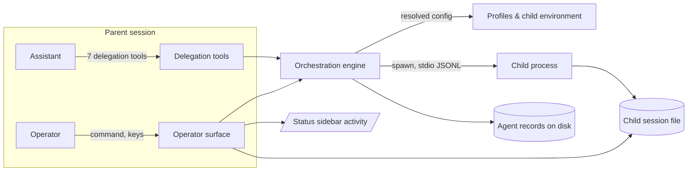

## 2. Problem Statement

A single assistant conversation loses effectiveness whenever it has to absorb a read-heavy errand:
scanning an unfamiliar tree, chasing a citation on the web, re-reading a diff for review, or grinding
out a mechanical edit across files. Each errand floods the working context with material that is
worthless once the answer is known, and one conversation cannot run two errands at once. Sub-agents
let the assistant hand a narrow task to a fresh-context child process and receive only the conclusion,
with the operator able to watch every child and stop all session children whenever the parent is idle.

- `[G-1]` An assistant delegates a narrow task to a fresh-context child and receives only its
  conclusion; the child's intermediate work never enters the assistant's conversation.
- `[G-2]` A settled child reaches the delegating assistant at most once, by exactly one route, for as
  long as the session process lives; the child's record is the durable artifact.
- `[G-3]` Independent errands run concurrently without the assistant duplicating a pending child's
  work.
- `[G-4]` The operator sees every running child, reads any current-session child's conversation, and
  stops all of them with one keypress while the parent session is idle.
- `[G-6]` Nothing stalls: every wait, request, and conversation has a bounded resolution, and records
  survive restarts without leaving processes behind.
- `[G-7]` A running child is visible without the operator asking: the session's status sidebar shows
  live children as ambient state.
- `[G-8]` A delegated errand may change files and verify its own work, not only report on them.

`[G-5]` is withdrawn. An earlier draft promised that delegation stayed inside a trust and cost
envelope only a maintainer could widen. It does not: a child is a full-powered agent with the same
tools as its parent, including a shell. The bound is the operator watching and the Escape key.

## 3. Key Design Decisions

| Decision                       | Choice                                                                                                                                        | Rationale                                                                                                                                                       |
| ------------------------------ | --------------------------------------------------------------------------------------------------------------------------------------------- | --------------------------------------------------------------------------------------------------------------------------------------------------------------- |
| `[KD-1]` Ownership scope       | An agent belongs to the session that created it; it is listed, read, steered, and stopped only from there, and there is no cross-session view | Control that crosses sessions has no owner to hold accountable and no coherent stop story, and a listing the assistant can see but the operator cannot is worse |
| `[KD-2]` Result delivery       | A settlement first claims a matching waiter; with no waiter it is announced into the owning session once                                      | The two delivery routes are mutually exclusive by construction, which is what keeps a race between a settling child and a wait from delivering twice            |
| `[KD-3]` Delegation mode       | A delegation waits for the conclusion unless the caller explicitly asks to be accepted immediately                                            | Most delegations exist because the answer decides the next step; waiting is also the mode that cannot duplicate work, so it is both default and encouraged      |
| `[KD-5]` Conversation lifetime | A child takes follow-ups until its context ceiling refuses one, with at most one follow-up in flight; guidance still prefers a fresh child    | A turn count is an arbitrary bound while context is the resource actually being consumed; serializing follow-ups is what gives a second message a defined order |
| `[KD-6]` Topology              | Delegation is flat: the delegation tools do not register inside a child process                                                               | A delegation tree has neither a bounded bill nor a bounded way to stop it, and the child's own environment marks it as a child                                  |
| `[KD-7]` Isolation             | A child starts as a separate process with no inherited skills, prompt templates, context files, conversation, or parent session identity      | The clean context is the product; a child that needs project conventions can be told them in its instruction, which is cheaper than a standing carve-out        |
| `[KD-8]` Durability            | Each agent is a JSON record on disk with its own session file and log; startup reaps orphans and prunes aged records                          | Conclusions outlive the session that asked for them, while an unreaped crash leaves children burning CPU nobody can see or hear from                            |
| `[KD-10]` Panic control        | Escape during a turn is the host's own cancellation, untouched; Escape while the session is idle stops every live child of the session        | The most-pressed key in the TUI keeps its meaning, and stopping children only when no turn is running means a stop never destroys a result someone was owed     |
| `[KD-13]` Ambient visibility   | Live children are published to the shared activity state the status sidebar renders                                                           | Every other operator view needs a command; this is the only place a running child is seen without asking, which is what makes the feature safe to leave on      |

Withdrawn: `[KD-4]` (profiles bound a child's tools), `[KD-9]`, `[KD-11]` (concurrency ceiling), and
`[KD-12]` (writing posture). Children hold the full tool set and there is no ceiling.

Shared behavior examples pin down the boundaries delegated to the leaves:

```text
foreground spawn -> child settles -> settlement returned from spawn_agent
background spawn -> acceptance returned -> child settles -> tagged announcement
background spawn -> acceptance returned -> wait claims child -> settlement returned, no announcement

parent context: conversation + skills + templates + context files + session identity
child context:  profile prompt + task instruction + child identity
```

| Host state                 | Escape behavior                                       |
| -------------------------- | ----------------------------------------------------- |
| Turn running               | Preserve host cancellation; do not interrupt children |
| Idle with live children    | Interrupt every live child owned by this session      |
| Idle without live children | Fall through unchanged                                |

## 4. Principles & Intents

- `[PI-1]` Clean context — a child's value is what it does not know; every default withholds rather
  than inherits, with no carve-outs.
- `[PI-2]` Conclusion only — reasoning and tool traffic stay inside the child; only its final text
  crosses the boundary.
- `[PI-3]` Bounded where it matters — context, follow-ups in flight, output size, and record retention
  each have a stated ceiling. Concurrency deliberately does not.
- `[PI-4]` Fail loudly, never hang — an unknown outcome resolves to a terminal one within a bounded
  time rather than staying pending.
- `[PI-5]` Refusals teach — a refusal names the limit it enforced and what to do instead, in one
  sentence.
- `[PI-6]` Operator sovereignty — anything running is visible in the session without being asked for,
  and stoppable without first selecting it.

## 5. Non-Goals

- `[NG-1]` Nested delegation.
- `[NG-2]` Operator- or user-authored profiles.
- `[NG-3]` Sharing the parent's conversation, skills, prompt templates, or context files into a child;
  no profile inherits any of them.
- `[NG-5]` Visibility or control of agents across session boundaries.
- `[NG-6]` Unbounded conversation with a child; the context ceiling is the bound, and the guidance
  treats a fresh child as the normal way to ask a second question.
- `[NG-7]` A child asking the operator for anything; a decision a child may not take alone is refused
  outright with the reason, never escalated and waited on.
- `[NG-9]` Multi-user or remote execution.

Withdrawn: `[NG-4]` and `[NG-8]`. Restricting a child's filesystem reach or denying it a shell are no
longer goals, because they are no longer done.

## 6. Caveats

- `[C-1]` The feature ships inside the `pi-extensions` package and loads and unloads with it; it can
  offer only what the host exposes to an extension — tools, commands, instruction text, session
  lifecycle hooks, terminal input, shared status state, and the host's output limits.
- `[C-2]` A profile's model is resolved from the parent's model by a fixed rule, so a machine without
  the required provider refuses the delegation rather than substituting another model.
- `[C-3]` The context ceiling is 200,000 tokens by default and is narrowed per profile to the resolved
  model's usable window, so a smaller model refuses a follow-up earlier than the default suggests.
- `[C-4]` A child is an independent OS process that can fail or vanish on its own, so ownership is
  verified before signalling on every platform the host supports.
- `[C-5]` Retention applies to records only; a still-running agent's record is never pruned.
- `[C-6]` A pending announcement lives in session-process memory: a conclusion is durable, but the
  obligation to announce it is not, so delivery is at-most-once and the record is what survives.
- `[C-7]` Results larger than the host accepts are truncated for delivery, with the full text written
  beside the record.
- `[C-9]` A restart ends continuability: a settled child's conclusion is still readable, but a
  follow-up after a restart is refused rather than resuming a dead process's conversation.
- `[C-10]` A child holds the same tools as its parent, shell included, so it can do anything the
  operator's own session can do. Profiles shape a child's model, prompt, and effort — not its powers.
- `[C-11]` Nothing limits how many children a session starts. A looping assistant can start an
  unbounded number; the sidebar shows them and Escape stops them.

## 7. High-Level Components



| Component                    | Module type         | Responsibility                                                                            |
| ---------------------------- | ------------------- | ----------------------------------------------------------------------------------------- |
| Profiles & child environment | TypeScript module   | Define the shipped profiles and resolve one into a model, prompt, effort, and environment |
| Orchestration engine         | Stateful TypeScript | Spawn, supervise, persist, wait on, continue, interrupt, reap, and prune agents           |
| Delegation tools             | Pi feature adapter  | Expose the seven tools, deliver settlements into the session, and inject guidance         |
| Operator surface             | Pi command + TUI    | Show live children ambiently, list and read them on demand, stop everything               |

Leaf execution order:

| Leaf             | Depends on     | Rationale                                                    |
| ---------------- | -------------- | ------------------------------------------------------------ |
| agent-profiles   | —              | Every spawn needs a resolved model, prompt, and environment  |
| orchestration    | agent-profiles | Owns lifecycle, records, and the delivery contract `[KD-2]`  |
| delegation-tools | orchestration  | Tools are a thin adapter over the engine's lifecycle API     |
| operator-surface | orchestration  | Reads records, child session files, activity state, stop-all |

## 8. Detailed Design

| Component                    | Leaf spec                                               |
| ---------------------------- | ------------------------------------------------------- |
| Profiles & child environment | `src/features/sub_agents/spec/agent-profiles.spec.md`   |
| Orchestration engine         | `src/features/sub_agents/spec/orchestration.spec.md`    |
| Delegation tools             | `src/features/sub_agents/spec/delegation-tools.spec.md` |
| Operator surface             | `src/features/sub_agents/spec/operator-surface.spec.md` |

## 9. Open Questions

None.

## Changelog

| Date       | Amendment                                                                                                                                                                                                                                                                                                                                                                                                                                            | Sections affected   | Reason                                                                                                                                                                                                                                                          |
| ---------- | ---------------------------------------------------------------------------------------------------------------------------------------------------------------------------------------------------------------------------------------------------------------------------------------------------------------------------------------------------------------------------------------------------------------------------------------------------- | ------------------- | --------------------------------------------------------------------------------------------------------------------------------------------------------------------------------------------------------------------------------------------------------------- |
| 2026-08-17 | Redesign: context-ceiling conversation lifetime, fixed concurrency ceiling, writing profile, combined turn-and-children stop, ambient sidebar visibility; blocked-child escalation dropped, leaving a gap at `[KD-9]`                                                                                                                                                                                                                                | 2, 3, 4, 5, 6, 7, 8 | Escalation was never needed in practice, uniform bounds replaced provider-specific ones, and a writing errand is the recurring gap `[G-8]` names                                                                                                                |
| 2026-08-17 | Envelope removed: `[G-5]`, `[KD-4]`, `[KD-11]`, `[KD-12]`, `[NG-4]`, `[NG-8]` withdrawn — children hold the full tool set including a shell, with no concurrency ceiling. Escape reverts to idle-only child stop. Delivery demoted to at-most-once with the record as the durable artifact. Isolation carve-out for context files dropped. Cross-session listing removed. Flat topology now enforced by suppressing tool registration inside a child | 2, 3, 4, 5, 6, 7    | Grilling established that the allow-list, posture, and ceiling described an envelope the design was not willing to enforce; naming a child a full-powered agent is the honest version, and every mechanism that existed only to maintain the fiction is deleted |
| 2026-08-21 | Add compact implementation examples for delivery ownership, delegation modes, child isolation, and panic control; clarify that conversation viewing is session-scoped                                                                                                                                                                                                                                                                                | 2, 3                | Make the shared contracts concrete without moving component detail out of the leaf specs                                                                                                                                                                        |
